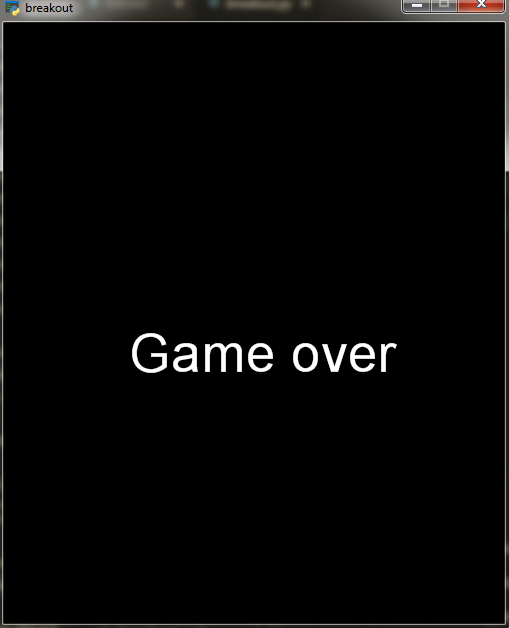

# Breakout

## To play the game, you need to install the arcade library
---

for install arcade
```
pip install arcade
```
---

## Do not let the ball pass the racket!!


## If the ball goes through the racket, you lose!!



# You have to clear all the squares to win